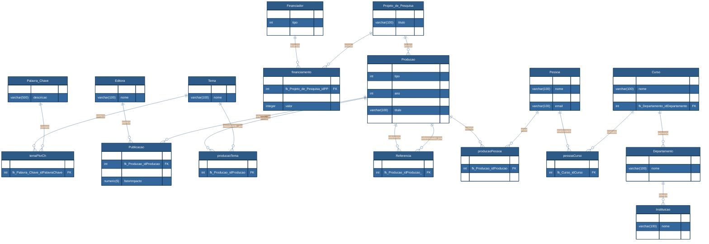

<b>Acervo Digital</b>

O projeto tem como objetivo desenvolver um acervo digital voltado à organização e consulta de trabalhos acadêmicos, artigos científicos e produções universitárias em geral. A aplicação permitirá o armazenamento estruturado de informações sobre autores, orientadores, cursos, áreas temáticas e instituições, possibilitando buscas eficientes e consultas analíticas sobre os dados cadastrados. Além de servir como ferramenta de apoio à gestão do conhecimento acadêmico, o sistema integrará recursos de inteligência artificial generativa para auxiliar o usuário na contextualização e resumo de trabalhos. Assim, o projeto visa oferecer uma plataforma útil tanto para alunos quanto para pesquisadores, promovendo o acesso e a organização do conteúdo científico institucional.

## Modelo Conceitual

    

---

## Modelo Lógico

---

[Requisitos completos do trabalho (PDF)](assets/DEC7129-Trabalho-Final.pdf)
